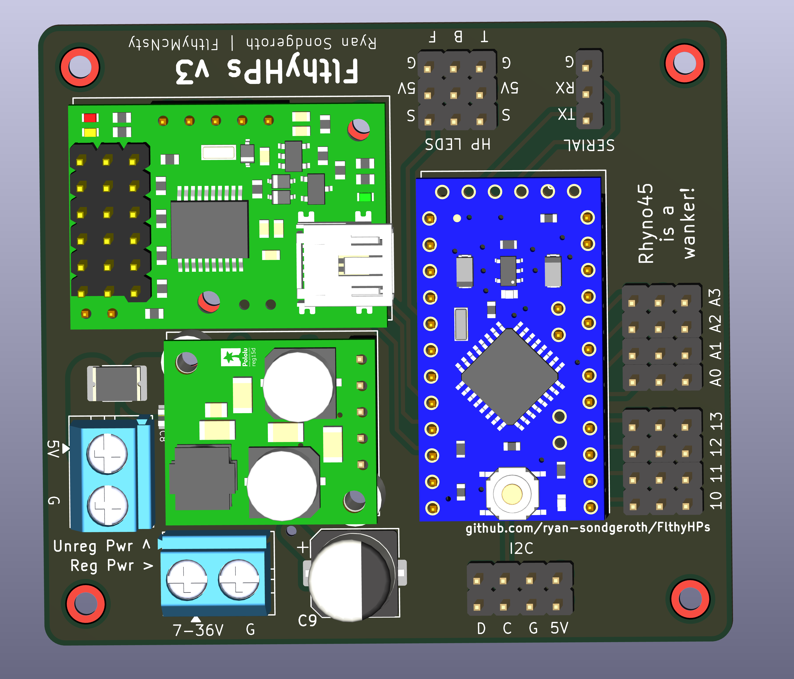
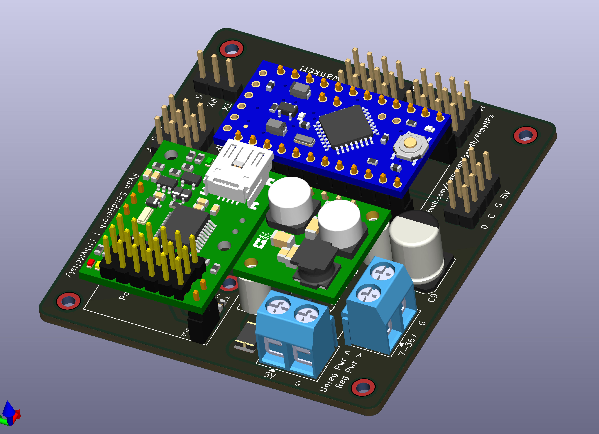

# FlthyHPs v3 — Bill of Materials

**PCB: FilthyHPs_Maestro**
**Date: 2026-03-27**
**Status: Ordered — awaiting fabrication**
**Author: Ryan Sondgeroth / FlthyMcNsty**

## PCB Renders

| Top | Isometric |
|-----|-----------|
|  |  |

---

> Excludes pre-bought modules: Arduino Pro Mini (U1), Pololu Micro Maestro 6 (U2), Pololu D24V50F5 regulator (U3) — these plug into headers on the board.

> **Pricing note:** Prices based on JLCPCB assembly pricing at 50 PCB qty as of 2026-03-27. All parts confirmed stocked at JLCPCB.

---

## Capacitors

| Ref | Qty | Value | Package | Manufacturer | MPN | JLCPCB # | Lib Type |
|-----|-----|-------|---------|--------------|-----|-----------|----------|
| C1, C4, C5, C6, C8 | 5 | 100nF 50V X7R | 0402 | Samsung | CL05B104KB54PNC | C307331 | Basic |
| C2 | 1 | 100µF 16V | 6.3x5.4mm SMD Al can | DMBJ | RVT1C101M0605 | C970684 | Extended |
| C3 | — | DNP | — | — | — | — | — |
| C7 | 1 | 100µF 6.3V X5R | 0805 | Samsung | CL21A107MQYNNWE | C16780 | Extended |
| C9 | 1 | 100µF 50V | 8x10.5mm SMD Al can | ST (Semtech) | CK1H101M-CRF10 | C129420 | Extended |

### JLCPCB Links
- C1/C4/C5/C6/C8: https://jlcpcb.com/partdetail/291005-CL05B104KB54PNC/C307331
- C2: https://jlcpcb.com/partdetail/DMBJ-RVT1C101M0605/C970684
- C7: https://jlcpcb.com/partdetail/SamsungElectroMechanics-CL21A107MQYNNWE/C16780
- C9: https://jlcpcb.com/partdetail/ST_Semtech-CK1H101MCRF10/C129420

### Footprint Notes
- C2: 6.3x5.4mm SMD aluminum can — use `Capacitor_SMD:CP_Elec_6.3x5.4` in KiCad. 5.4mm tall, fits under Maestro module on 2.54mm headers (~8mm clearance)
- C3: **DNP** — removed. Single C2 at 100µF is sufficient for 6-servo bulk buffering with D24V50F5 5A regulator
- C7: Same 0805 footprint, no change needed
- C9: 8x10.5mm SMD aluminum can — use `Capacitor_SMD:CP_Elec_8x10` in KiCad. Not under any module, height is fine

---

## Semiconductors

| Ref | Qty | Value | Package | Manufacturer | MPN | JLCPCB # | Lib Type |
|-----|-----|-------|---------|--------------|-----|-----------|----------|
| D1, D2 | 2 | 5.1V Zener | SOT-23 | onsemi | BZX84C5V1LT1G | C47075 | Extended |
| Q1 | 1 | P-ch MOSFET | SOT-23 | Alpha & Omega | AO3401A | C15127 | Basic |

### JLCPCB Links
- D1/D2: https://jlcpcb.com/partdetail/onsemi-BZX84C5V1LT1G/C47075
- Q1: https://jlcpcb.com/partdetail/Alpha_OmegaSemicon-AO3401A/C15127

### Q1 Substitution Note
AO3401A replaces Vishay SI2323DS-T1-GE3. Same SOT-23 footprint, same pin-out (GSD). AO3401A is an improvement: 4A vs 2.3A Id, 85mΩ vs 95mΩ Rds(on), same Vgs(th) range. Well within requirements for VIN_RAW gate switch driving 6 small servos.

---

## Resistors

| Ref | Qty | Value | Package | Manufacturer | MPN | JLCPCB # | Lib Type |
|-----|-----|-------|---------|--------------|-----|-----------|----------|
| R1 | 1 | 100k 1% 1/8W | 0805 | UNI-ROYAL | 0805W8F1003T5E | C149504 | Basic |
| R2 | 1 | 10k 1% 1/8W | 0805 | UNI-ROYAL | 0805W8F1002T5E | C17414 | Basic |

### JLCPCB Links
- R1: https://jlcpcb.com/partdetail/160838-0805W8F1003T5E/C149504
- R2: https://jlcpcb.com/partdetail/18102-0805W8F1002T5E/C17414

---

## Protection

| Ref | Qty | Value | Package | Manufacturer | MPN | JLCPCB # | Lib Type |
|-----|-----|-------|---------|--------------|-----|-----------|----------|
| F1 | 1 | 500mA hold PTC | 1812 SMD | Bourns | MF-MSMF050-2 | C17313 | Extended |

### JLCPCB Links
- F1: https://jlcpcb.com/partdetail/BOURNS-MF_MSMF0502/C17313

---

## Connectors

| Ref | Qty | Value | Type | Manufacturer | MPN | JLCPCB # | Notes |
|-----|-----|-------|------|--------------|-----|-----------|-------|
| J1, J8 | 2 | 2-pos 5mm | Screw terminal PCB | Phoenix Contact | 1935161 | — | Source externally |
| J2 | 1 | 1x3 2.54mm | Pin header | Sullins | PRPC003SAAN-RC | — | Source externally |
| J3, J4, J5 | 3 | 1x3 2.54mm | Pin header | Sullins | PRPC003SAAN-RC | — | Source externally |
| J6, J7 | 2 | 1x4 2.54mm | Pin header | Sullins | PRPC004SAAN-RC | — | Source externally |

---

## Parts Substitution Notes

| Ref | Original MPN | Reason Replaced | Replacement MPN | JLCPCB # |
|-----|-------------|-----------------|-----------------|----------|
| C2 | TPME477M010R0030 (470µF E-case tantalum) | Not stocked at JLCPCB; overkill for 6-servo load with 5A regulator | RVT1C101M0605 (100µF 16V 6.3x5.4mm Al can) | C970684 |
| C3 | TPME477M010R0030 | Removed — single 100µF C2 is sufficient | DNP | — |
| C9 | A767KN476M1HLAE029 (47µF 50V Al-poly) | Not stocked at JLCPCB | CK1H101M-CRF10 (100µF 50V 8x10.5mm Al can) | C129420 |
| C1/C4/C5/C6/C8 | GRM155R71E104KE14D (25V) | Not stocked at JLCPCB | CL05B104KB54PNC (50V, better rating) | C307331 |
| Q1 | SI2323DS-T1-GE3 (Vishay) | Not stocked at JLCPCB | AO3401A (Alpha & Omega, better specs) | C15127 |

---

## Pre-Bought Modules (not on PCB BOM)

| Item | Qty | Est. Unit $ | Line Total | Source | Notes |
|------|-----|-------------|------------|--------|-------|
| Arduino Pro Mini 5V 16MHz | 1 | $5.00 | $5.00 | SparkFun / Amazon | Plugs into U1 headers |
| Pololu Micro Maestro 6-Channel | 1 | $30.00 | $30.00 | Pololu #1350 | Plugs into U2 headers |
| Pololu D24V50F5 5V 5A Regulator | 1 | $30.00 | $30.00 | Pololu #2851 | Plugs into U3 headers |

**Modules Subtotal: $65.00**
